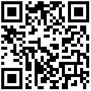

# Blockchain Demo
A web-based demonstration of blockchain concepts.

[](https://www.youtube.com/watch?v=_160oMzblY8)

This is a very basic visual introduction to the concepts behind a blockchain. We introduce 
the idea of an immutable ledger using an interactive web demo that is available here:

http://anders.com/blockchain/

## Setup
Get the code:

```
git clone https://github.com/anders94/blockchain-demo.git
```

Install dependencies:

```
cd blockchain-demo
npm install
```
Run the server:

```
./bin/www
```

Point a web browser at the demo:

```
http://localhost:3000
```

## Setup using Docker

Get the code:

```
git clone https://github.com/anders94/blockchain-demo.git
```

Run the Docker setup:

```
cd blockchain-demo
docker-compose up -d
```

Point a web browser at the demo:

```
http://localhost:3000
```

## Optional Configuration
You can adjust the "number of zeros" required by the demo by editing the first two lines of
`public/javascripts/blockchain.js`.

Because there are 16 possible characters in a hex value, each time you incrament the difficulty
by one you make the puzzle 16 times harder. In my testing, a difficulty of 6 requires a
maximumNonce well over 500,000,000.

If you adjust the difficulty above 4, blocks will show up as not mined because the demo data
assumes 4 zeros for a signed block. For example, on the `http://localhost:3000/block` page
with a difficulty of 6, the first nonce that works is `8719932` yielding a hash of
`000000669445c22167511857d8f3b822b331c3342f25dfdcb326e35c1a7aa267`.

Currently in production blockchains such as bitcoin, an example successful hash looks like 
`000000000000000000ff10807faff9fd6de55f79c73177ddc127527051401185`. That's 18 zeros in a row!

## Send Thanks



Bitcoin greatfully accepted: `1K3NvcuZzVTueHW1qhkG2Cm3viRkh2EXJp`
